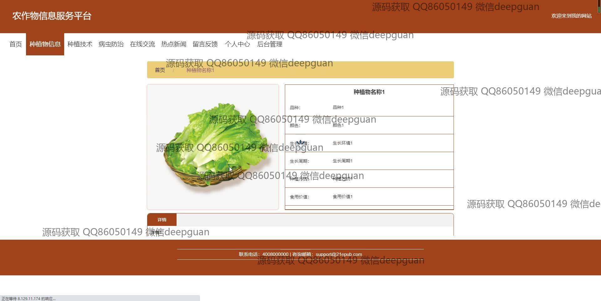
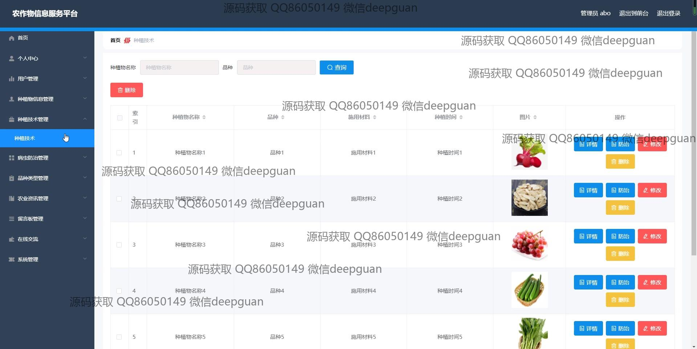

<h1 align="center">基于javaweb技术的农作物信息服务平台的设计与实现</h1>

## 简介
农作物信息服务平台：角色分为管理员、用户；功能包括农作物管理、种植技术、病虫防治、在线交流、多样化查询及用户管理，支持全面信息录入与更新等模块。    --计算机毕业设计源码；毕设源码；java毕业设计源码

## 联系方式

<h3 align="center">获取完整代码与数据库文件 + 微信：deepguan QQ: 86050149 QQ群: 783742310</h3>

<h3 align="center">可帮忙远程部署 包运行成功！提供远程部署、修改代码、设计文档指导、代码讲解等服务！</h3>

## 功能介绍（完整见运行截图）
管理员：管理平台的整体用户管理，包括查看、修改和删除用户信息。管理和更新农作物信息，如品种、颜色、生长环境、食用价值等。负责种植信息、种植技术和病虫防治管理，更新轮播图展示内容和管理留言信息。维护导航栏包括种植技术、品种类别和在线交流等模块，提供对帖子的查看、编辑和删除功能，确保系统稳定运行。

用户：访问平台的首页、种植物信息、种植技术及病虫防治等模块，通过在线交流和留言反馈功能，与其他用户和管理者互动。浏览和查询农作物的详细信息，包括品种、生长环境和用药信息等。使用个人中心查看和编辑个人资料，管理收藏信息，优化种植和病虫防治效率。可以通过搜索框查询特定信息，参与留言和帖子互动，提升农业知识和实践能力。

## 运行截图

本代码来源于网络,仅供学习参考使用!

